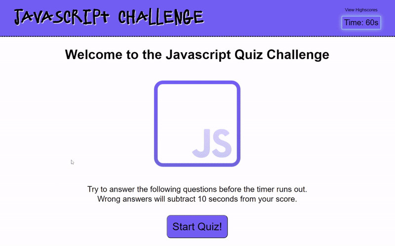

# JavaScript Challenge Quiz

## General info
This is a JavaScript quiz game presented in a multiple choice question format. It consists of a landing page which prompts the user to start the game or view the high scores list, and when the game begins they must answer all the questions within the time limit, which changes dynamically based on how many questions are in the set. Questions answered incorrectly will incur a time penalty.

When the last question is answered, or when time runs out, the player will be taken to a submission page where they can enter their initials. When submitted, a high score chart is updated and saved locally, and the player is taken to a page showing all the scores logged on their PC. The player can choose to clear the high scores list from this page.

## Website
[Javascript Challenge](https://jshmtchll.github.io/quiz-game/)

## Screenshots

## Code 
* HTML
* CSS
* JavaScript

## Status
Project is complete.

## Contact
Created by Josh Mitchell. 
